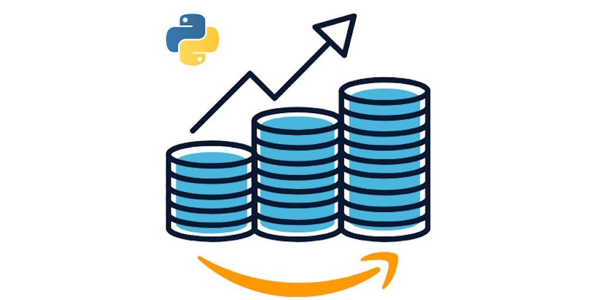

# Introduction to the Format

The TV limited series, or mini-series format is one of the most effective story-telling mechanisms. Band Of Brothers, Chernobyl, True Detective; allowing characters to grow over multiple episodes in a way that a 90 minute movie could never accomplish. The actions of a protagonist are more meaningful when the viewer understands the context in which those decisions were made.

I read a lot of blogs. I receive a great deal of value from them. But most posts are the anti-thesis of the limited series format. Often times, they <mark>focus on the how without ever mentioning the why</mark>, leaving the reader to guess under what context a decision is made. 800 words explaining __how to__ setup CI/CD or __how to__ inject pytest fixtures; without ever explaining the __why__ behind the technologies or patterns being implemented.

Enter the "limited series" blog format. I'll strive to provide context around **each decision** made. **Each technology** being used.  **Each coding pattern** that can lead to an unusable heap of buggy code. And why others are elegant and extendable. Each episode will have a main character or focus, and will generally proceed in chronological time, with the occasional flashback or dream sequence.

# What this blog series is...and what it isn't

## What it is

- **An implementation of a long-only, equity strategy.** There are much more complicated algorithms out there to gain/lose money. This strategy does not short the market as a hedge, nor does it deal in the dark arts of options strategies. These constraints are crucial to understand when architecting a solution. Querying/storing options data is an arduous problem, not for the faint of heart. If you are interested in a top quality options algorithm trading strategy, I'd recommend [Option Alpha](https://optionalpha.com). I'm a happy user of the product and knowledge base, but I'm not affiliated nor sponsored by them.

- **An opinionated way to build a best-in-class trading bot on the cheap** There are better, more flexible ways to build a trading bot. Most of them involve spinning up an expensive data store like ElasticSearch. We will be focused on optimizing 3-month holding periods, analyzing momentum over the previous 12 months. Doing so enables us to build a solution purpose-built for the task.

- **A software engineering resource for fundamental understanding.** When discussing software patterns, you'll find this series to favor depth over breadth. I'll do my best to provide examples on __why__ something like import side effects are bad. Not just simply stating it as fact.

## What it isn't

- **A way to get rich quick**
- **Sound investment advice**
- **A step-by-step guide to programming.** Don't expect to be able to follow this series as a step-by-step tutorial unless you have a fundamental knowledge of AWS, Python, and Linux. That said, anyone with a penchant for finance or computers can appreciate every episode.

## Who I Am

- **An optimistic, technology enthusiast**. I get really interested in problem domains and learn as much as I can. Occasionally, I like to write about those experiences.
- **A software professional** that has been working in tech for over 10 years. I've built software across a dizzying array of organizations. Federal government, local government, small tech, big tech, private equity, venture capital. I've been part of companies that went bust. I've been lucky enough to have taken part in multiple acquisitions, or as they say in the valley, "exits".
- **A pythonista**, but dabble in other languages depending on the purpose. I prefer to leave the frontend for those with design & UX talent.
- **I really love building things.** Specifically things that involve bits of code. More specifically knowing how those bits run in a production environment. I focus on making sure code can be executed in a production environment without losing sleep, wondering, "I wonder if my bot has been executing for the last couple weeks?"

## Who You Are

- A **finance person** that is interested in seeing how the sausage gets made. Learning what "testable" code is. Why something like "fault-tolerance" is important when building software in the age of sketchy network connections and cloud architectures.
- A **developer or data scientist** looking to beef up on their operations skills. Many of you out there are going to be able to write better jupyter notebooks than I can, but don't have a lot of expertise in the operations space, AKA DevOps
- A **DevOps person** interested in knowing more about how those developers and data scientists build their code. More empathy for your customer is always a good thing.
- I did not mention a **security person**. It's everyone's job to think about security & privacy. Encrypting secrets, minimizing surface area for attack vectors, protecting PII. These are priorities that every professional needs to hold close to their hearts.

## What Will You Learn?

- Local development setup
- Turbo-charging your coding skills
- Debugging Docker with VSCode
- Implementing a momentum algorithm
- Data pipelines
- Serverless architecture
- CI/CD pipeline with GitHub Actions
- Use case for AWS S3 As A Database (SAAD)
- Authentication - oauth token dances and how to access secrets
- Testing patterns
- Strategy Backtesting - building clean, readable jupyter notebooks to prove your status as Master of Coin.

## Time To Binge!

If any of the above sound interesting to you, this is the binge-worthy Limited Series for you! I'll be updating this post with links to episodes as they are released:
- [Sharpening Our Tools](/blog/sharpening-our-tools/)
- Interactive Debugging with Docker: The Holy Grail
- [Fun side-project _or_ Production-quality Application?](/blog/production-quality-application-backtest-results/)
- [Making technical decisions - S3 as a Database (SAAD)](/blog/saad/)
- Testing our code, keeping our sanity
- CI/CD - Lowering Bus factor
- Back to the Future: Pulling data from the past to inform the future
- Getting Robots to do our Job

The series is meant to be read from start-to-finish, but in a world where time is finite, jump around as you see fit. If you're really interested in learning how to harness pytest, skip to "Testing our code, keeping our sanity". If you'd rather look at some pretty graphs and see results from backtesting, skip to the end of the "Fun side-project _or_ Production-quality Application?" post.

I hope that you, the reader, are able to take something away from these upcoming posts.
