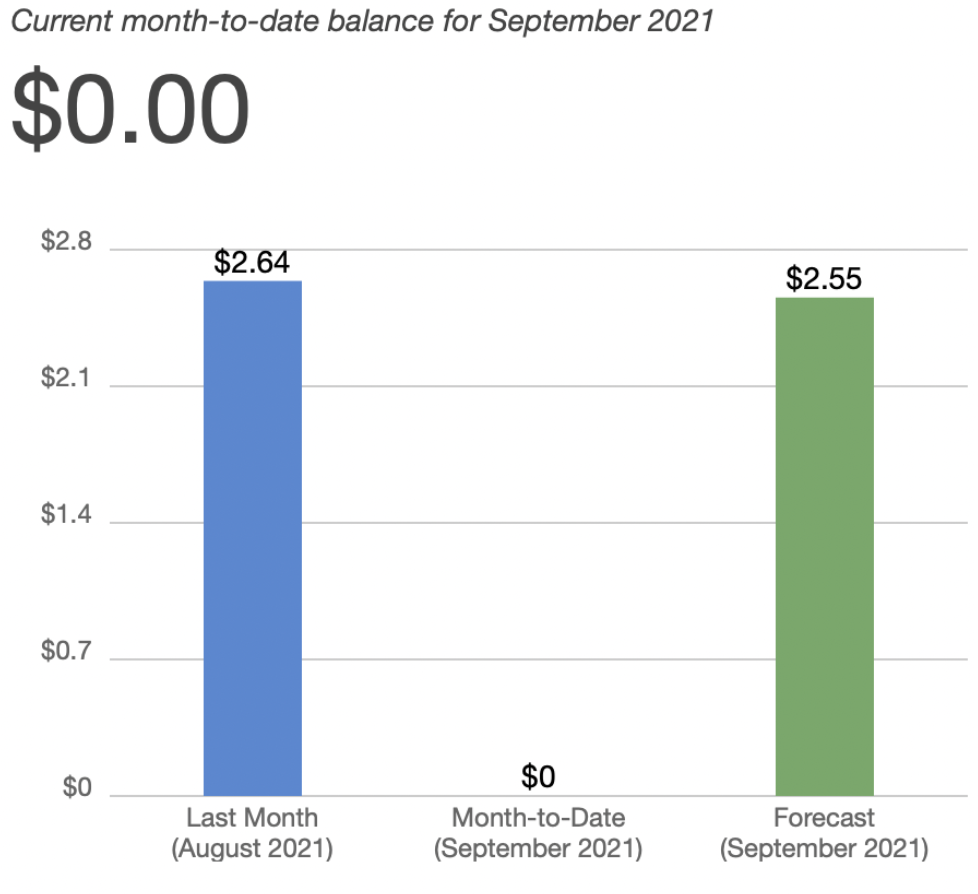

> This episode is part of an on-going series. If you'd like to understand some of the context around this article, please see this [introduction episode](/blog/aws-python-trading-bot-intro/).

The entirety of this limited series has been focused on the [quality-momentum](https://github.com/lucasnad27/quality-momentum) repo. The purpose of which is to create tear sheets for a quantitative momentum algorithm and allow us to choose `n` number of quality stocks to invest in. But we have a problem.

The whole point of the clickbait title was to operate for less than $5 / month. I alluded to cheap data storage solutions with the [Making technical decisions - S3 as a Database (SAAD)](/blog/saad) episode, but didn't talk about the data itself. This episode will focus on

- How to get 30 years of data for backtesting
- How to get data going forward without eating into future returns
- Being a good API citizen

# Catching up on 30 years of data

## Context

I had two goals in building the first iteration of this trading bot:
1. Remove management fees from existing ETFs that track this algorithm
2. Take advantage of my "alpha" - my ability, as a retail investor to get in & out of equities that big firms can't due to liquidity issues

That second bullet point is why we need to **thoroughly backtest** any deviations from the algorithms that have been built by the fine folks at [Alpha Architects](https://alphaarchitect.com). TDAmeritrade provides [an API](https://developer.tdameritrade.com/apis) that allows a developer to pull back all the free data they could ever hope to. But it has its limitations:
- Only has data going back 20 years
- Does not calculate the [adjusted close](https://www.investopedia.com/terms/a/adjusted_closing_price.asp)
- No way to identify what stocks were trading on a given market for a given day

## 3rd-party API saves the day

Given these limitations, TDAmeritrade API is a non-starter for pulling backtest data. To get my S3 bucket populated, I turned to [EOD Historical Data](https://eodhistoricaldata.com). For $80 per month you get access to a treasure trove of data with well-implemented APIs. As per their TOS, you can store the data you pull off of their API for non-commercial use. Only paying for one month of service, I was able to get my S3 database seeded with all EOD prices & market caps for all equities trading on US exchanges, going back 30 years.

### The Devil is in the Details

EOD Historical Data was a great resource, but it had its bumps. For instance, when pulling EOD prices for January 19, 1995, the market cap was still pegged to today's valuations. Without sanity-checking our data, this would have invalidated any backtest we ran because market cap is a key attribute when identifying our universe of stocks.

Given this data issue, I was forced to pull historical outstanding share data on all equities and update market cap value for each day. Given daily API rate-limits, this 3x'd the time it took to calculate all the data required for backtesting.

That being said, I was quite happy with my experience using EOD Historical Data.

### Executing our data pull

When building out the logic to seed the SAAD, I opted for a [KISS](https://en.wikipedia.org/wiki/KISS_principle) implementation. I built a simple CLI tool that takes a start date. When executed, it...

1. Pulls data from the API
2. Chucks the response into a Pandas DataFrame
3. Performs some lightweight transformations
4. Serializes the data into a csv
5. Uploads to SAAD
6. Rinse & Repeat

All of this was done on my desktop, no need to involve the cloud for this operation. The implementation is straightforward and is best reviewed by looking at the code. Below are some highlights that may provide a few extra arrows in your ETL quiver:

- Entry point to [pull EOD prices from API to S3](https://github.com/lucasnad27/stock-universe/blob/f837b8ba59cec2631bfc30d768c01c7f63d85e92/historical_backfill/main.py#L29) and for [market cap updates](https://github.com/lucasnad27/stock-universe/blob/f837b8ba59cec2631bfc30d768c01c7f63d85e92/historical_backfill/main.py#L54)
    - We utilize the 3rd party library `click` to organize all of our CLI commands. By wrapping them in a single `cli` click group we enable others to easily discover available functions & arguments without opening our source code.
- [In-memory memoize](https://github.com/lucasnad27/stock-universe/blob/f837b8ba59cec2631bfc30d768c01c7f63d85e92/historical_backfill/main.py#L113) implementation to reduce number of API calls
    - Many API implementations miss out on "free" performance bumps. Memoizing a function in python is as simple as wrapping a function with the `functools.cache` decorator. You can also set the max size of the cache to avoid memory bloat.
- [Retry mechanism](https://github.com/lucasnad27/stock-universe/blob/f837b8ba59cec2631bfc30d768c01c7f63d85e92/historical_backfill/main.py#L167) to handle rate-limiting and flaky network connections
    - Retry logic is an absolute must for any networking operations. Without it is to assume perfect, fast connectivity 100% of the time. With the proliferation of communication over HTTP and GRPC, implementing complex retry logic is a simple task in python, using the [tenacity](https://tenacity.readthedocs.io/en/latest/) library. Avoid issues when encountering flaky network connections, dependencies on 3rd party services, and react kindly to API rate-limiting, and avoid being labeled as a troublesome client.

# Staying up-to-date

Fast-forward in time. Parameters are set for optimal risk/reward ratio. We've got 30 years of data ready to use in s3 in the future. But what about that future? We've architected our system to pull data from SAAD. We can build a "just-in-time" data pull TDAmeritrade within our jupyter notebooks, or we can keep our SAAD up-to-date, providing a single source of truth for any future client. Our next (and last!) episode's focus will show how to setup an ongoing data pull from TDAmeritrade to SAAD. More specifically...

- Running **secure** workloads on the cloud
- Setting up automated, periodic tasks
- Event Driven Architecture for serverless workloads
- Logging & Error Handling
- Deploying serverless functions

All of this will lead to an AWS bill that looks like a rounding error...

Until next time!
