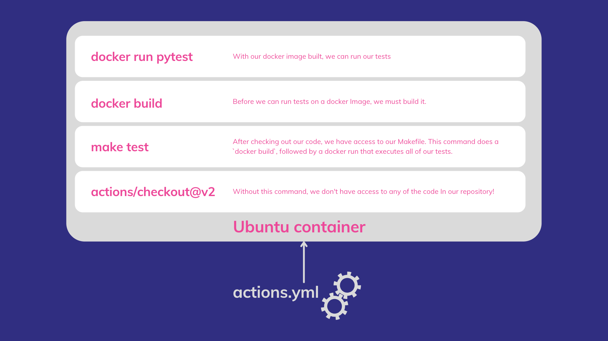

> This episode is part of an on-going series. If you'd like to understand some of the context around this article, please see this [introduction episode](/blog/aws-python-trading-bot-intro/).

# Deploying code yesterday and today

A true trailblazer at the start of my career as a software engineer, I had the slickest method for deploying my code. It usually went something like this…

1. Copy/paste my code directory and rename it `<super-cool-project>_<todays_date>`
2. Take said directory, compress it to a zip file
3. Transfer zip file to a thumb drive
4. Walk thumb drive over to a sysadmin with access to the production server racks
5. Sysadmin throws my zip file into some directory, restarts the IIS service
6. Bask in achievement and call it a day

Since then, I’ve made a few improvements to my deployment pipeline. Here’s what this process looks like today:
1. Tag the git commit.
2. Get back to work.

What a difference 10 years makes! More reliable, less error-prone, less cognitive load. CI/CD is a crucial process relied upon by all high-performing engineering organizations. In this episode, we'll cover:
- Early & Often: why everyone should set up a CI/CD pipeline on all projects
- Deployment Methodology
- Real-world CI/CD example using GitHub Actions

# Why CI/CD?

“**Bus factor**” is a common, albeit morbid reference to the idea of how much a PITA it would be if you were struck by a bus. Unable to dump your knowledge to a co-worker before taking that fateful walk across the street, all of your internal knowledge related to that bespoke deployment process evaporates into the ether, as you take your last breath. A helpful thought experiment for software developers. We should all optimize for a small bus factor. Writing better READMEs, better docs, readable code are all excellent steps to take. The penultimate way to reduce your bus factor is to implement CI/CD on all projects you contribute to.

Add CI/CD to your organization's stack, and you'll see immediate decrease in bus factor. But there are strong 2nd & 3rd order effects that result from implementing a clean pipeline for testing & deploying your code. And one need not depend on my anecdotal stories to convince you. Google has put some of their brightest minds behind the __[Accelerate State of DevOps](https://services.google.com/fh/files/misc/state-of-devops-2019.pdf)__ report. Within, they identify a cohort of "elite performers". What makes these elite performers so good?

- deploy code 208 times more frequently
- go from code to commit to deploy 106 times faster
- recover from incidents 2,604 times faster
- 1/7th as likely to fail when taking a change to production when compared with other cohorts

Sounds like a good group to associate with, yeah? And <mark>what is at the core of this profound increase in stability and velocity? Continuous Integration and Continuous Delivery - aka CI/CD.</mark>


Numerous best practices feed into continuous delivery. One can't YOLO into production without good monitoring. Continuous Delivery sits at the intersection of many best practices. The <mark>inability to implement CI/CD is a reliable indicator that something else in the software stack is lacking or non-existent</mark>.

# CI/CD Implementations

The industry seems to have settled on the following pattern

- Add a dot file with a .yaml extension to the root directory of a repo
- Add job (or workflow) configurations with instructions on what commands  (tests, linting, deployment) to run, on what kind of container.
- Add instructions on when to run each workflow: all commits, a specific branch, a specific tagging regex pattern, hitting some big red button

Based on this yaml file, a 3rd party (GitHub, CircleCI, GitLab) will spin up an ephemeral container on your behalf, run those commands and return a 👌🏼 or 🙅🏼‍♂️ based on exit codes. With this general pattern, you can switch CI/CD providers with little to no pain. Picking CircleCI vs GitHub Actions is not a differentiator for most products. Pick one and start building.

> YMMV: This is not true for all organizations. Some projects require special runners or on-premise solutions.

# Optimizing CI flow

Using the quality-momentum repo, let's move from theory to practice. We are going to review an 11-line CI/CD configuration and discuss how it came to be. Within the `.github/workflows` directory of the repo, there is an [actions.yml](https://github.com/lucasnad27/quality-momentum/blob/c75e9735bc1a0f49f73d34fc4ed35a469d28d938/.github/workflows/actions.yml) file. The name of the yml file is not of consequence for the build.

```yaml{numberLines:true}
name: Quality Momentum
on: [push]
jobs:
  test:
    runs-on: ubuntu-latest
    env:
      DOCKER_BUILDKIT: 1
    steps:
      - uses: actions/checkout@v2
      - name: Run tests through docker
        run: make test
```
Line 2 indicates that we run all jobs whenever changes are pushed changes to the GitHub remote repository, regardless of the branch. This is highly variable depending on an organization's needs. Line 4 defines a job called `test`. The remainder of the file specifies:
- to create a container running the latest ubuntu docker image
- to add a `DOCKER_BUILDKIT` env var is set in the container
- to check out the code
- to run the `make test` command within the container

This article is by no means a step-by-step quick start. For a more detailed explanation of Actions and workflow files, [this](https://docs.github.com/en/actions/learn-github-actions/understanding-github-actions#understanding-the-workflow-file) is a great place to start.

`make test` is defined in our Makefile. We use this file to put commonly used commands in a single, searchable place; similar to `npm run` commands in a package.json file. The [test command](https://github.com/lucasnad27/quality-momentum/blob/c75e9735bc1a0f49f73d34fc4ed35a469d28d938/Makefile#L15) builds a docker image based on the `primary` target and then runs `pytest`. Some may be scratching their heads at this point..._"You mean you're spinning up an ubuntu docker container only to build and run a docker container inside of it?"_...Why yes I am!

By utilizing our Dockerfile for both local builds and CI/CD, we point to a single source of truth. Depending on your project and it's dependencies, you may opt for a config that installs & runs directly on the container provided by your CI/CD. Now, if  all of this "containers within containers" discussion is making you feel like a cast member of Inception, the below diagram should help.



If you've worked with CI or Docker before, you'll notice one glaring weakness in the above diagram. We have to run `docker build` every time. Docker has built-in caching magic, enabling us to take build times from 5 minutes to 5 seconds. And while we take advantage of those caching mechanisms locally, there are no guarantees that cache will persist between subsequent workflows. A great next step would be to add an action that explicitly saves a cache for later use. This [blog post](https://dev.to/dtinth/caching-docker-builds-in-github-actions-which-approach-is-the-fastest-a-research-18ei) does an excellent job of enumerating various options and performance.

Building optimized docker files is an absolute must. Build times can quickly balloon out of control. <mark>Equipped with a few fundamental pieces of Docker knowledge will save you days of unnecessary time spent</mark> waiting for tests to pass. Not to mention the potential cost savings. I've optimized [this Dockerfile](https://github.com/lucasnad27/quality-momentum/blob/c75e9735bc1a0f49f73d34fc4ed35a469d28d938/Dockerfile) to use [multi-stage builds](https://docs.docker.com/develop/develop-images/multistage-build/) and efficient use of the `COPY` command to ensure that CPU-intensive dependency builds like numpy are only done when our cache gets blown away or we modify our dependency file. If you're interested in seeing a follow-up post on docker efficiencies, please [reach out](https://electricocean.io/contact/). If there's enough interest, I'll go down the Docker rabbit hole.

# Start your CI/CD journey...today

Implementing CI/CD isn't a decision to be made, it is table stakes as a fundamental lynchpin for any successful software team. It reduces BUS factor across an organization while increasing _stability_ and _velocity_. Two concepts that are commonly held in opposition to one another. Start small. Add a single workflow that fails if linting errors are discovered. Require that the program builds without errors. And work your way towards a fully automated pipeline and throw out that 10 step "how to deploy" .txt file. Now if you'll excuse me, I need to deploy this blog post...git push... 🪄
