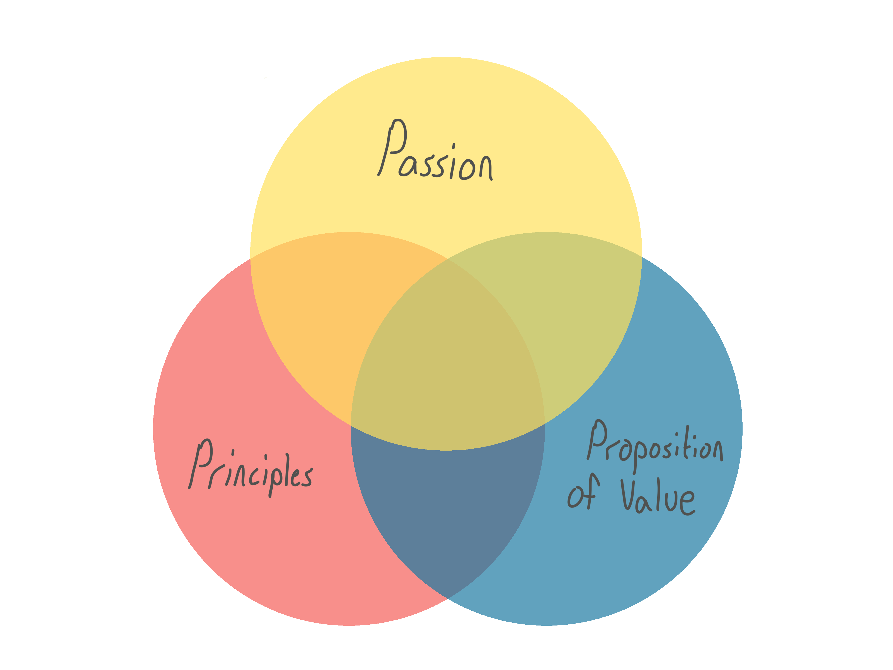
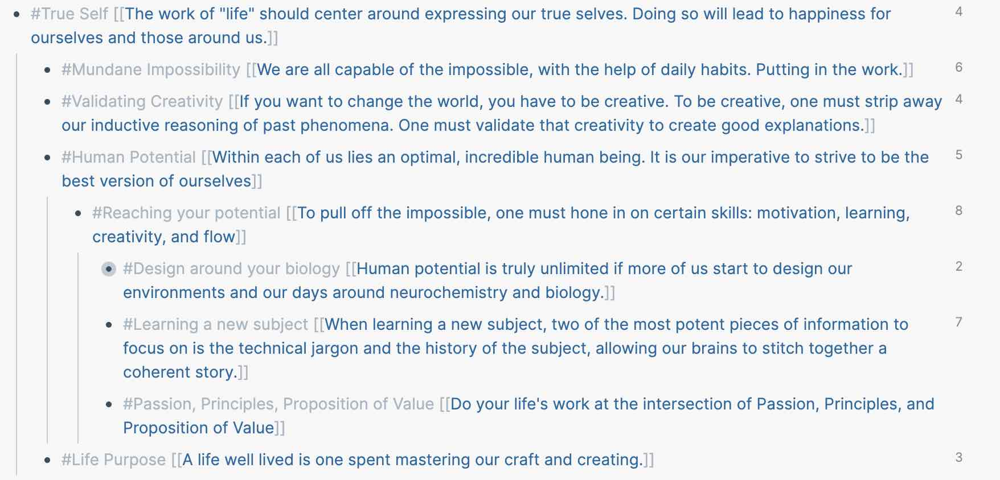
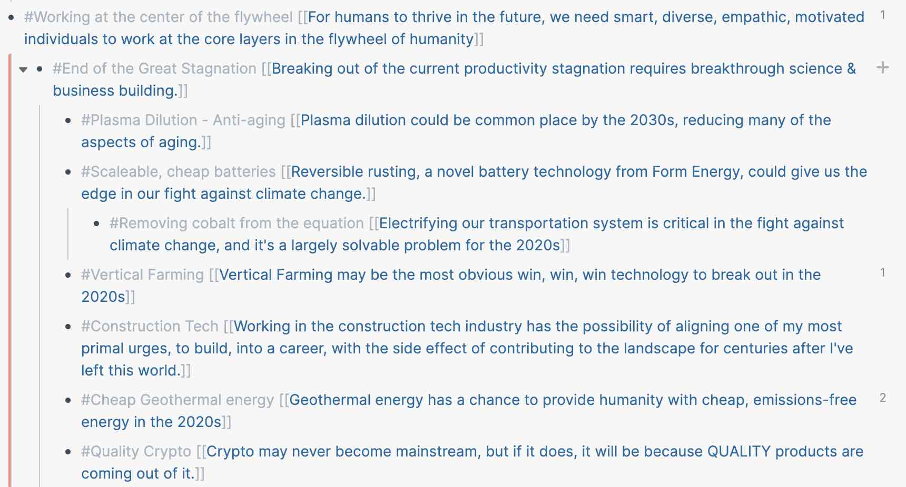

# Introduction

The purpose of this piece is to analyze a framework for building a successful career with the well-intended side effect of making the world a better place. We will discuss the philosophy informing this career framework, its components, and practical tips on crafting this framework to optimize for a successful, impactful career.

> DISCLAIMER: I recognize that writing about "choosing" careers is, in itself, an extremely privileged position to be in. And I wouldn't deny that privilege plays an important role in career success. I've attempted to craft everything below to be applicable for __all humans__, not __just a select few__.

# Becoming a Peak Performer

Presenting a fairly bleak and meager view of humanity, the Harvard psychologist William James explained humans as such:

> The human individual lives usually far within his limits; he possesses powers of various sorts which he habitually fails to use. He energizes below his maximum, and he behaves below his optimum.

This quote was pulled from [The Art of Impossible](https://www.goodreads.com/book/show/50209348-the-art-of-impossible) and it strikes at one of the core motivations behind our framework. As Kotler puts it:

> Motivation is what gets you into this game

Without intrinsic catalysts: motivation, passion, purpose; making progress in life can be a daunting, seemingly impossible task. But flip that statement on its head and ^^the idea of living a full, lustrous life moves from impossible --> possible --> probable^^. From a statistical outlier to the statistical average.

If you're interested in the science behind peak performance, I highly recommend taking a few hours to read Steven Kotler's [book](https://www.goodreads.com/book/show/50209348-the-art-of-impossible). Here are a few shiny lures to entice would-be readers...

- Stacking __drivers__ to activate biological virtuous cycles
- How to be __600% more creative__
- Cut your learning time in half

Knowing that becoming a peak performer is predicated on having passion and purpose in life, the __why__ becomes much more important than the __how__. The __why__ is informed by these three circles...

Let's break these down.

## Principles

Principles can be defined as a core set of values that drive everyday decision making. Spending time to think and write out your principles has an outsized ROI in life, enabling you to make better, faster decisions. You'll find that many of your principles have been lurking beneath the surface since your childhood years. Converting those latent, ambiguous feelings into words can have a profound impact on one's life.

### Examples

Finding my own set of life principles is an ongoing project. Building these principles was a function of my genetics, upbringing, and education. I'm sharing these not for you to copy/paste, but rather to provide a template. Minus a few personal omissions...

These principles are not built out of thin air. Each bullet point links back to a primary source. A book. A conversation. A tweet. Accompanied by my own thoughts. As more and more bullet points build, common threads of thought emerge. Reviewing these principles over time has enabled me to develop a strong sense for career choices, backed by primary sources and enthusiasm. In no particular order, those industries are:

- Biotech
- Climate Change
- Privacy

## Passion

The age old advice of "follow your passion" need not apply here. We need to consider them in the context of our other two circles. One can have a passion for baseball, or punk bands from the 80s. While it would be a shame to discard these passions, unless your __Proposition of Value__ includes, "win the genetic lottery and become the next Babe Ruth", chances are these should be hobbies, not job options.

Some of your most powerful passions will be the things that others hate, or at least find dreadfully boring. "Powerful" equates to finding a passion that is likely to intersect with your:

1. Principles - a passion that is intrinsically motivated to improve society
2. Proposition of Value - a passion that leverages your unique skill set

## Proposition of Value

Principles and Passion typically take a long time to figure out. They are also notoriously difficult to change over time. Value is different. We can very quickly change our proposition of value and leverage skills gained to align with our __Principles__ & __Passions__.

### Example 1

You're in college and there is a healthcare problem. You are  passionate about solving it within the next decade. You continue your Liberal Arts education but start taking more Biology courses. By doing so, you learn more about the field and better understand the problem space. Most importantly, you identify if you have the potential to create a positive impact.

### Example 2

You are a research scientist. You believe machine learning (ML) will advance critical  areas of society. After researching (ah, your specialty!), you take a handful of Udemy/Skillshare courses focused on Python and the "ML stack" to help get a foot in the door as a key contributor to an open source project like [Pandas](https://github.com/pandas-dev/pandas). A year later you are still missing a Computer Science degree, but your diverse background as a scientist, paired with visible work on important ML projects leads you to get a job as an AI researcher!

Get creative and gritty when identifying how to create value for the principles & passions you care deeply about. This is the fun part.

# Conclusion

We've now discussed the fundamentals of our impact decision-making framework. This is not the end product, **this is a starting place**. Defining the size and location of each circle is the real work. If you're interested in learning more about how to optimize these three circles, please [reach out](https://electricocean.io/contact/) and tell me what to write about next! Future blog posts could include:

- How to Quanity your Potential Impact
- Principles: How To Find Them
- Passion: Finding the things you love that everyone else hates
- Superhuman Protocol: Increasing your value prop to society

Thank you for taking the time to read this article and good luck in your journey.
