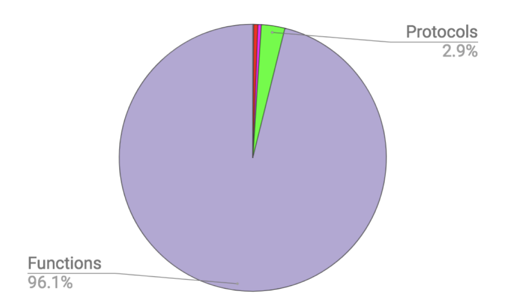
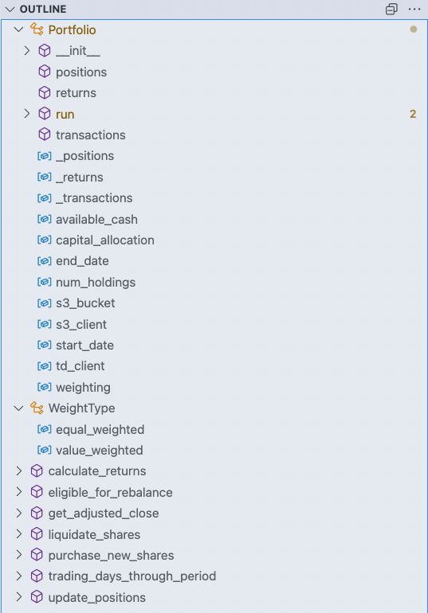
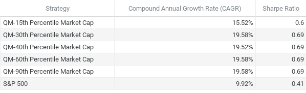

In this episode, we'll explain _how_ we are building our trading bot. We'll cover...
- organizing & storing our code
- what our data "sandbox" looks like
- iterating on prototypes with jupyter
- functional programming paradigms
- **results of our backtest**!!

Wow, we're covering a lot here! Let's get to it.

# The purpose of the repository

Creating a new repository can be daunting. It's the equivalent of the writer's blank page. Much like eating an elephant, the only way to accomplish the task at hand is one bite at a time. Up first is identifying the succinct purpose the repository serves.

### Bad Example
> Sandbox for playing around with quality momentum

### Good Example
> A python library that creates Pyfolio tear sheets for a quantitative momentum algorithm

The difference between those two descriptions is miles a part, or kilometers if you prefer. The former took 15 seconds while the latter took 1 minute. I'd say it was well worth it.

<infoblock>
👩‍💻 DEVELOPER NOTE: I know the idea of a "succinct purpose" sounds simple and obvious. Recall projects you've worked on in the past and has been in production for a couple years. Chances are that repository has no description indicating it's primary purpose, enabling confusion among new developers and scope creep as the repo matures. Decisions made early in the lifecycle will ripple across the remainder of the code's life cycle, good or bad.
</infoblock>

<infoblock>
📈 FINANCE NOTE: A repository is a place where you store your code. Code should be managed within a version control system to easily rewind & fast-forward through iterations of your code. This enables us to easily see what's changed, manage access to the code and trigger deployments.
</infoblock>

# Playing in the sand

The majority of our initial data discovery & analysis will occur in [jupyter](https://jupyter.org).

<infoblock>
📖 DEFINITION: Jupyter is an open-source web application that allows you to create and share documents that contain live code, equations, visualizations and narrative text.
</infoblock>


This is **not** where our core logic will be stored. <mark>The way we've organized our file structure enables us to more easily __productionize__ our code while maintaining the natural data science workflow; experimentation & quick iteration.</mark> How does that happen? If one were to look through the set of [python notebooks](https://github.com/lucasnad27/quality-momentum/tree/main/notebooks) and organize by timestamp you'll find that earlier notebooks are focused on discovery.
- authenticating to 3rd-party finance APIs
- playing around with query parameters
- reviewing a pandas DataFrame once it's been converted from an http response

As you continue to discover more within the Jupyter environment; you should start seeing helpful abstractions form: ideas for functions, bad data to build test cases against, etc., This is the time when shift to building a quality, shiny API. To frame this in web 2.0 parlance, Jupyter will be a thin "client" and the python source code, `quality-momentum` will be the "server", doing the majority of the data manipulation, algorithm magic, etc.,

<infoblock> 
👩‍💻 DEVELOPER NOTE: Some newer developers might be confused about building an API that doesn't have a web interface via HTTP. An API is a restful web service you pull json from. An API is also a GraphQL server. An API is also a 3rd party library you depend on to execute logic. An API is also a set of functions or classes that you write and intend to use elsewhere within your codebase.
</infoblock>

# Production Quality Financial Backtesting

## Our North Star

What should a "Quality Momentum Portfolio" API look like? This is one of those moments in software engineering where science intersects art. This problem could be taken in a million different directions. My implementation will never look like anyone else's. Neither will yours. But not all implementations are created equal. We should **strive for an implementation that has two primary features**
- _Easy to grok with little to no documentation_ - it just makes sense
- _Easily Testable_ - testable code == better code == less bugs == better product

## "self"-less functions

Understanding the core concepts of functional programming make you a better developer. Why? Let's take a moment to discuss. Functions are extremely important in functional programming, it's literally in the name. What makes a function a __pure__ function?
- Take input --> produce output
- No Side Effects
- Immutable

Code with this set of properties has a much-desired side effect. <mark>Your code gets easier & quicker to test.</mark> Testable code is better code. It increases team velocity. It decreases bugs. All yielding to a better product with less effort over the lifecycle of a project.

### Real-world example

Pedestal is a set of libraries used to build services and applications. It serves up whole HTML pages & handles API requests. Here are some high-level stats about the project:
- 18,706 LOC
- 28 protocols
- 8 bridges to the stateful world
- 9 record types
- 1 multi-method
- **944 functions**

When you break this down into a pie chart, the result is remarkable...


So what does this mean? It allows us to easily test 96% of our code base without worrying about undo side effects, complex setup code, and writing straight forward assertions. If you want to learn more about functional programming, I highly suggest Russ Olsen's talk, [Functional Programming in 40 Minutes](https://youtu.be/0if71HOyVjY). Now, let's take a look at how our Portfolio class is constructed.

### Portfolio class

So we can all agree that functional programming is great. Why did I build a Portfolio **class** then? Because we're going to be cafeteria developers. We'll be putting bits & pieces of the functional vs object-oriented paradigms onto our "plate". Getting the best of both worlds for our purpose while circumventing the swamp-laden grounds of dogmatic opinion.

Looking at an outline of your code is akin to reading through a table of contents (ToC) before reading a book. After scanning, you have a greater understanding of the structure of a book, along with a general idea of where the plot is headed. <mark>VSCode can quickly help you build your own ToC, enabling you to understand what the code does without reading one line</mark>



You'll notice a few striking properties of the portfolio.py file shown above. We have two classes, `WeightType` & `Portfolio`. Everything else is a function. The Portfolio class has 3 properties: positions, returns, and transactions, and 1 function `run`. It also has a host of stateful attributes that will constantly change. <mark>All the heavy lifting is done outside of our Portfolio class.</mark> Put another way, most of the code we need to test is outside of our Portfolio class.

Shaping the code in this way optimizes for easily testable, pure functions. We achieve this by stripping all stateful attributes from our functions and provide them as inputs to our functions. Examples of stateful attributes:
- current portfolio positions
- available cash
- returns over time

I tend to learn better with concrete examples, even if it's sloppy pseudocode on a whiteboard. Reading __about__ something is different from seeing it. In this implementation which we will call _logic-ful Portfolio_, the majority of our logic is completed inside of the `Portfolio` class. You can view the entire implementation by looking at this [gist](https://gist.github.com/lucasnad27/eb39dc7afdbbfc26821c459129aa3ad1). A few key observations with our tests...

```python{numberLines: true}
@mock.patch('client.s3_client')
def test_portfolio_update_postions():
    # need to mock our s3_client so that our portfolio can initialize
    portfolio = Portfolio(capital_allocation=100000..., start_date=... end_date=...)
    # set the _transactions property so that our update_positions has the data it needs within
    # this Portfolio instance, hope we remember all the other pieces of state we need to set up
    # to get this test working!
    portfolio._transactions = pd.DataFrame(...)
    portfolio.update_positions()
    expected_positions = ...
    assert expected_positions == portfolio.positions
```

The test client must know about internal mechanisms to test basic functionality: 
- `portfolio._transactions = pd.DataFrame(...)` 
- The tests are required to instantiate a class object for every scenario: `portfolio = Portfolio(...)` 
- Each test is responsible for mocking external dependencies such as an s3 client and TDAmeritrade API calls, which can be quite...cantankerous.

In contrast, let's review a Portfolio implementation with minimal logic and write the equivalent test coverage, a [logic-less Portfolio](https://gist.github.com/lucasnad27/a7243a816ab5ab4c41d983125f7aacc9). 

```python {numberLines: true}
def test_update_positions(s3_client, s3_bucket, transactions):
    expected_positions = pd.DataFrame(...)
    positions = update_positions(s3_client, s3_bucket, transactions, "2020-01-01")
    assert expected_positions == positions
```

Notice the stark difference in our testing patterns:
- We are able to take better advantage of pytest's fixtures (more on this in a later post) by injecting a smart `s3_client` faker
- It's painfully obvious what we are trying to test. A function that takes a dataframe of transactions and outputs a dataframe of positions.
- Portfolio implementation details need not concern us.
Optimizing for ease of testing may seem more academic than practical when coding, but the secondary and tertiary effects are well worth the initial effort. It enables us to write less bugs, more features and develop kick ass software products.

### Leveraging pyfolio

[Pyfolio](https://quantopian.github.io/pyfolio/) is a fantastic library, originally developed by the fine folks at Quantopian Inc.,. Unfortunately, after [Quantopian was acquired by Robinhood](https://finance.yahoo.com/news/quantopian-joins-robinhood-democratize-finance-022402556.html) the upkeep of the Quantopian github org has fallen into disarray. Libraries aren't getting patched and published to pypi. Some README's tell you to go to a prominent fork to continue development. Other's leave the detective work for you to figure out. Putting this aside, the work of the Quantopian developers enables us to build on the shoulders of giants.

Pyfolio works out-of-the-box with [zipline](https://github.com/quantopian/zipline), a popular backtesting tool. It wasn't going to work for the quantitative momentum algorithm though. To work around this, I aimed to create a clean integration point between pyfolio and the `Portfolio` class implementation described above. By creating a series of dataframes: positions, returns, and transactions, we can leverage pyfolio tear sheets, providing us with drawdown periods, sharpe ratio, CAGR, etc.,

<infoblock>
📈 FINANCE NOTE: Sharpe ratios and compound annual growth rate (CAGR) are common measures to help us understand the inherit risk/reward for any given strategy. A higher CAGR means more $$. A higher sharpe ratio means you achieved that CAGR with less volatility and risk over time.
</infoblock>

# And the results...

We have a set of jupyter notebooks, that are able to pull in our 1st-party quality_momentum library; a library with a clean interface for our client and battle-tested with succinct, easy to implement tests. Is it time to profit?? Let's find out...



<infoblock>
🐲 DISCLAIMER: These are eye-wateringly good numbers, but beware, there be dragons! Backtesting is not a guarantee of future performance. While the sharpe ratio indicates lower volatility & risk than chucking your money into an undifferentiated bet on the S&P 500, an investor would still go through multiple <b>wild swings</b>. Diversification is your friend and every investor's goals are different.
</infoblock>

As you can see from the table above, the quantitative momentum strategy, implemented over the last 30 years delivered in spades. This methodology <mark>outperforms the S&P 500</mark> over the long haul, and <mark>does so with less volatility!</mark> What does a CAGR of 19% look like? **Allocating $100,000 to this portfolio in 1992 would yield you a cool $21,000,000** as of August 2021. Not bad! To see the code that generated these results, go have a look at these [jupyter notebooks](https://github.com/lucasnad27/quality-momentum/tree/d2b78cac3d048bc90a453bc7dc1563cde15960e8/notebooks/backtests/market_cap_percentiles).

This is the most nutritionally dense episode in the series. We covered how to experiment with different trading strategies by using Jupyter notebooks as a sandbox. We took those experimental, non-tested bits of code and created a clean, well-tested API that we can distribute to other developers & traders. Finally, we backtested our strategy over 30 years with a variety of parameters to give us a better feel for potential future performance if we were to allocate capital to this strategy.
