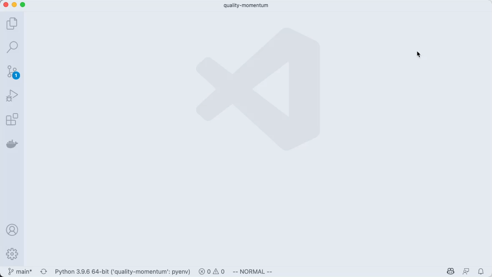

> This episode is part of an on-going series. If you'd like to understand some of the context around this article, please see this [introduction episode](/blog/aws-python-trading-bot-intro/).

The title of this episode harkens back to a line from one of my all-time favorite leaders, Abraham Lincoln.

> Give me six hours to chop down a tree and I will spend the first four sharpening the axe

Which reminds me of another famous quote from the great emancipator...

> The problem with internet quotes...is that you never know how authentic they are.

Kidding aside, it's fitting that we spend the first blog episode covering everything we want to do _before_ we start coding. If you don't identify as a developer, you'll have a few new tricks up your sleeve when you need to sling some code together to process that giant .csv export from Salesforce. If you are a developer, I hope you find some guiding principles to help you craft your own local development setup. The hours you spend perfecting & tweaking your setup today, pays dividends for the rest of your career.

<infoblock>
  💁🏼‍♂️ Throughout this post, I refer to the reader as a "developer". In the context of this post, a _developer_ is anyone creating & iterating something on a computer. Whether it's a google sheet or emacs, the principles laid out in this post apply across specializations.
</infoblock>

# Feedback loops

I'll admit, I'm a sucker for a well-tuned development environment. If someone can refactor a function to a different file, open a terminal that executes that function, and then auto-formats their code, all without leaving the comfort of their keyboard, I've found a new life-long friend.

Building that setup doesn't happen overnight. And for many, it never happens. Investing upfront time in building an ideal workflow unlocks new levels of productivity and zen-like flow when sitting in front of your text editor. Why? <mark>Feedback loops.<mark/>

Feedback loops are important in any aspect of life, but they are particularly important in programming. Why?

## Time - O(n) vs O(1)

This is a painfully obvious side effect of neglecting your development cycle early on in a project's life. The earlier you minimize your coding feedback loops, the more time it saves you in the long run.

### Crunching the numbers

Let's take a hypothetical project and calculate just how much time we save by getting our dev environment optimized. I'll assume we end up working 3 months to get a project done (never mind that the initial estimate was 3 weeks 😳 ). And I'm juggling other priorities, at best...2 hours per day, 5 days per week. That totals up to 120 hours to complete the project. The Makefile enables quick and easy test runs: `make test`. Here is what that command looks like
```plain text
test: build
	docker run qualitymomentum:primary pytest ./tests
```

Let's be generous and say it __only__ takes 4 test runs on average before you have your new feature or bug fix ready to go. And you build up two of these features/fixes per day. That's 8 test runs. And only 2 of them need to be full test runs.

For the sake of injecting some reality into this hypothetical situation, I'll use __real__ numbers from the quality-momentum implementation.
```plain text
make test  0.38s user 0.18s system 4% cpu 11.876 total
```

11 seconds. Not bad we say!

Now, because I was simultaneously lazy and anxious to get to the "real work" I dove right into the code and didn't take a few minutes to setup a way to run tests for a __single__ function. I have to run the entire test suite. I know this might sound crazy, but I've been around enough developers, myself included, to know that this happens all 👏🏼 the 👏🏼 time 👏🏼 . If I take the same codebase and run tests on a single function, within a docker container that's already built and running, here's our execution time

```plain text
real    0m1.477s
user    0m1.243s
sys     0m0.118s
```

1.4 seconds...a tenth of the time it took to run the entire test suite. Now for some back-of-the-napkin math...

- **8 full test runs per day** * 11.3 seconds * ~65 working days = **96 minutes**
- (**6 function-only test runs per day** * 1.4 seconds * ~65 working days) + (2 full test runs per day * 11.3 seconds * ~65 working days)  = **26 minutes**
- That is **70 minutes of savings over the course of 3 months**, and that's only if you're working on a project for a couple hours every day.
- The example provided pales in comparison to a more typical scenario. A __high quality__ codebase will have **their total test & build runtime in under 15 minutes**. If you replace our 11.3 second full test suite runtime with a more realistic time of ~15 minutes, those **<mark>70 minutes of saved time turns into 70 hours</mark>**. If that 15 minute runtime sounds unrealistic, don't take my word for it, you can listen to someone that really knows what they are talking about in this [blog post](https://charity.wtf/2020/12/31/why-are-my-tests-so-slow-a-list-of-likely-suspects-anti-patterns-and-unresolved-personal-trauma/).

As the test suite grows, our feedback loop will have a time complexity of O(n) using the "shit let's start coding now" technique. Compare that to O(1) for a well-tooled setup. We would all jump at the opportunity to improve an algorithms time-complexity from O(n) to O(1). <mark>We should be just as enthusiastic at optimizing Big-O notation for our feedback loops as we are for our complex algorithms.</mark>

## Flow

Not convinced on sharpening that ax yet? Time saved is a relatively small first-order effect when evaluating feedback loops. But the 2nd and 3rd order effects is where the developer productivity flywheel starts to build momentum.  It's accomplished with the mystical state of **Flow**.

In his book, [The Art of Impossible](https://www.goodreads.com/book/show/50209348-the-art-of-impossible), author Steven Kotler dives into the world of flow and the neurological science used to exploit this state of being. Why flow? Steven captured the essence of it here...

> those moments of rapt attention and total absorption when you get so focused on the task at hand that everything else disappears.

The effects that flow has on your work is truly astounding.

> ...the bigger impacts are cognitive. Motivation and productivity, creativity and innovation, learning and memory, empathy and environmental awareness, and cooperation and collaboration all skyrocket--in some studies as high as 500 percent above baseline.

Steven highlights immediate feedback as one of the most important aspects of getting, and staying, in flow. Understanding your tools as a developer enables one to optimize for tighter feedback loops, ultimately leading to quality __and__ speed. Two concepts usually pitted against one another, working in concert.

# Optimizing the loop

Now that we understand the power of the feedback loop, it's essential to create ones that are accurate and fast. How do we optimize for accuracy and speed? Here's the instruction manual for a software developer building a data-heavy python project:

## Dependency Setup

Python and data science go hand-in-hand. It's unfortunate that the data science stack is one of the more complicated and nuanced in the python ecosystem. Data science typically requires pandas. Pandas requires numpy. Numpy requires GCC, a compiler, and this is where differences in your OS can cause headaches. For instance, at the time of writing this episode, I couldn't get numpy to work properly on an M1 Mac. To avoid this pain for ourselves and other contributors, [Docker](https://www.docker.com) is a great solution for cross-platform compatibility.

### Dockerfile

The `Dockerfile` instructs docker how to build a virtual machine for us

```shell{numberLines: true}
FROM python:3.9.6-slim as base

RUN apt update
RUN apt install git build-essential -y

WORKDIR /quality-momentum

# Dependency setup
RUN pip install --upgrade pip
RUN pip install pip-tools

COPY ./setup/*.txt ./
COPY . /quality-momentum
RUN --mount=type=cache,target=/root/.cache/pip \
    pip-sync requirements.txt --pip-args '--no-cache-dir --no-deps'

COPY . /quality-momentum

FROM base as debugger

ENTRYPOINT ["python", "-m", "debugpy", "--listen", "0.0.0.0:5678", "--wait-for-client", "-m"]

FROM base as jupyter
EXPOSE 8888
CMD ["jupyter", "lab", "--NotebookApp.token=''", "--no-browser", "--ip=0.0.0.0", "--allow-root"]

FROM base as primary
ENTRYPOINT ["python", "-m"]
```

### docker-compose

We are using `docker-compose` as a local development tool. It's simple and effective.

```shell{numberLines: true}
version: '3.4'
services:
  jupyter:
    restart: always
    build:
      context: ./
      dockerfile: Dockerfile
      target: jupyter
    container_name: qualitymomentum_jupyter
    ports:
      - "127.0.0.1:8888:8888"
    volumes:
      - .:/quality-momentum
    env_file: .env
    command: "jupyter lab --NotebookApp.token='' --no-browser --ip=0.0.0.0 --allow-root"
```

We'll touch on our use of docker throughout the blog series. I'm not going line-by-line on these files, but if you'd like me to elaborate on this setup, please [reach out](https://electricocean.io/contact/) to request follow-up posts.

## Test Driven Development (TDD)

You don't have to be a TDD zealot. Want to write some application code first to get the creative juices flowing? Go for it. Perhaps you like to start with pseudo tests to build out a new internal API. Be my guest, but once you have that initial blueprint in code, you should have a test file open for reference **at all times**. As you write more code, you continue executing & writing tests. <mark>Test-driven development is the most accurate, tight feedback loop you can implement</mark> today. Making those tests faster: lowering setup/teardown costs between test runs, having an always-on testing environment ready to go, will tighten that feedback loop even more, leading to less time and more flow.

## VSCode

VSCode is a first-class text editor. So is emacs. So is vi. So is Sublime. Just don't use Microsoft Word. This section will be directly applicable to VSCode and Python. Your text editor should have similar mechanisms for most languages.

### Workspace environment

Our workspace environment enables us to override settings that are set at the "user" level. This is a great place to specify your python virtual environment, add a `src` directory to enable auto-complete, specify a custom path to your .pylintrc, etc., It generally sits at the root of your repo and while it __can__ contain folders from across your filesystem, I recommend keeping it to a single repo's contents. Here's an idea of how to get to your workspace settings and what mine looks like for `quality-momentum`...



### Debugging w/ Docker

Under the vain of minimizing feedback loops, I went down the rabbit hole that is known as "remote debugging with docker". It's not a tale for the faint of heart. Epic enough to demand its own episode. If you're interested in learning about how to set breakpoints in VSCode while executing commands within a docker container, Interactive Debugging with Docker: The Holy Grail (TBA re: release date) will prove to be an invaluable resource. If not, consider skipping it and just know that it's possible, but it's not ideal for our TDD feedback loop.

### Debugging in reality

Considerable effort has been spent building a bad-ass integration between docker + debugger + pytest and we can't realistically use it. What now? Enter ipdb, a world without GUI debuggers.

ipdb is a powerful tool for a python developer. It launches a smart REPL, known as ipython to help you debug. Throw the `set_trace()` function where you want the code to break into a debug session. Here's the basic flow for a coding session:

1. Run an always-on container
2. Add your `set_trace()` where needed
3. Attach to a shell in the docker container
4. `pytest ./tests/test_foo.py::test_calculate_foo -s`

How did we accomplish this? There are many roads to this destination, but here's how I did it. I used my Docker jupyter implementation, created with `docker-compose`. Using this existing docker-compose setup provided out of the box features that I wouldn't otherwise have:

- **Real-time file updates inside docker process** - Docker volumes enable real-time updates between host machine & virtual machine. i.e., I make an update in my text editor and it immediately updates within the docker image that I'm running.
- **Environment variables at the ready** - While integrating with third party APIs, authentication should never be accomplished by writing a secret to a file that is connected to git. This is an excellent way to get hacked. And if you think, "Oh, I'll remove it before I commit or push to my remote"...you aren't the first person to think that before exposing credentials, and you aren't the last. Having an easy way to initialize env vars in a `.env` file, is a great convenience feature.
- **Zero build time** - With the qualitymomentum_jupyter service running via compose, I was able to access jupyter lab through my browser via network bridge. Anytime I needed to hop into an ipython shell or run a specific test, I could do so without waiting for a build or ballooning the memory footprint or CPU usage of docker.
- **Shell history** - If you keep the same image up & running during your entire coding session, your session history becomes very helpful.

"Attach shell" and you're off & running. Here's what it looks like in action.


For a more thorough explanation on what's happening, watch [this video](https://www.loom.com/share/57f8a4d0bee743448f0f2e8ef84290a2)

# Time to Chop Down the Tree

If you've made it this far and have grok'd the material...congratulations! You know more about the tools of your trade than 90% of other developers. Ultimately, we do have to get some __real__ work done, and hooking an Alexa device to your code editor to trigger linting whenever your garage door opens is not the best use of your time. Ultimately, <mark>it's up to every developer to find their own sweet spot</mark>. Use the instruction manual above as a guideline, not a rule. With our axes sharpened, it's time to get to work on that tree.

## Next episode...

We are ready to discuss how to make local docker development work for you, not against you. I'll update this post with a link to the article after it has been released.
